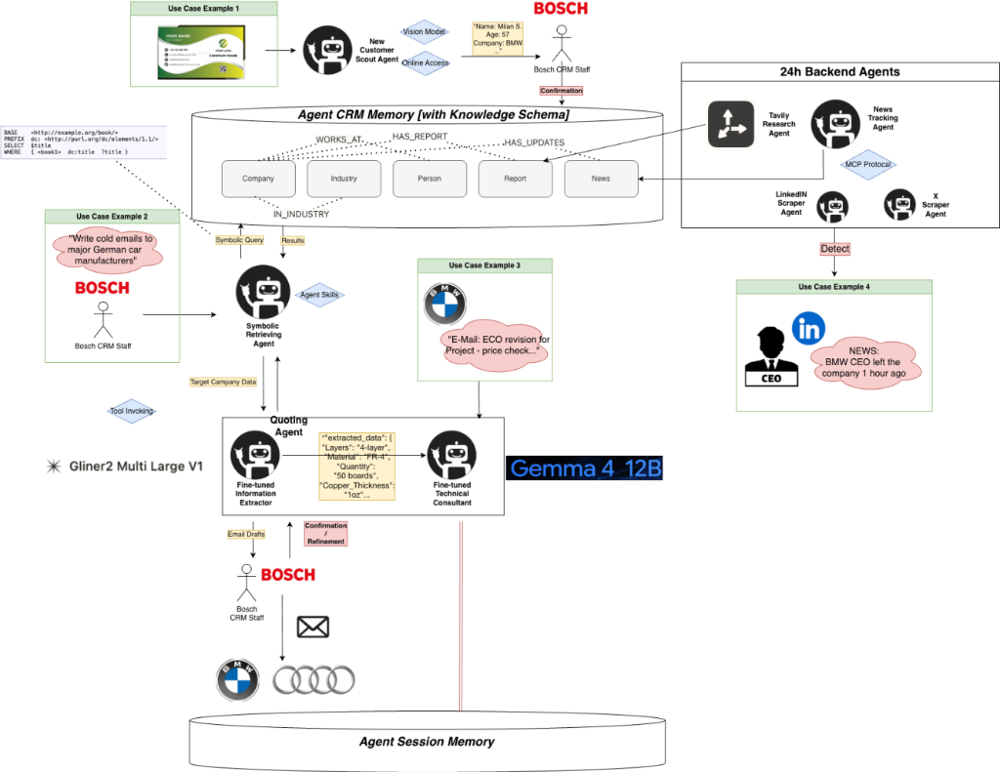

# CogniSell — AI Relationship OS

**An auditable "second brain" for long-cycle industrial sales.**

👉 **Project Introduction**: [https://duck-ai-yy.github.io/CogniSell/](https://duck-ai-yy.github.io/CogniSell/)

🎬 **Live Demo Video**: [https://github.com/duck-ai-yy/CogniSell/blob/main/demo.mp4](https://github.com/duck-ai-yy/CogniSell/blob/main/demo.mp4)

Every customer relationship is stored as a human-readable knowledge graph — not a black-box embedding. Each edge carries a **cognitive state** (`proposed → confirmed → corrected → retired`), so you always know *who believed what*, at what confidence, and how the picture evolved over time.

---

## The Problem

Enterprise sales in industrial B2B (steel, manufacturing, heavy machinery) run on **long cycles** — 6 to 18 months from first handshake to closed deal. During that time:

- Relationship context scatters across emails, CRMs, sticky notes, and memory
- Key commitments and next-steps get buried in thread #47
- Contacts go cold after 90 days — silently, with no alert
- When a champion changes jobs, the signal arrives too late

Traditional CRMs track *transactions*. AI CRMs stuff everything into vector memory. Neither gives you what a salesperson actually needs: **a legible, auditable map of who knows what, and how sure we are.**

## The Solution

CogniSell treats every relationship fact as a **triple with cognitive metadata**:

```
(Andreas Vogel) —[committed_to]→ (Send RFQ by end of month)
   source: email_thread    confidence: 0.83
   status: confirmed       extractor: GLiNER2
```

This single data model powers three core scenarios — no separate schemas, no data silos:

| Scenario | What Happens |
|---|---|
| **Scan & Enrich** | Scan a business card → OCR → extract fields → enrich from company data → propose nodes/edges → human confirms or corrects in Decision Inbox |
| **Outreach & Digest** | Multi-agent strategy debate → cold email draft → send → parse reply → extract new commitments → graph grows |
| **Relationship Decay** | 90-day inactivity sweep → cold contacts turn grey → catch-up suggestions based on graph context → job-change auto-detection with red-dot alerts |

---

## Architecture



### Key Design Decisions

- **Legibility over convenience** — Every edge is human-readable with explicit confidence and provenance. Vector memory was deliberately rejected; auditability is the differentiator.

- **One schema, three scenarios** — Business card scanning, email outreach, and relationship decay all operate on the same triple + cognitive-state model. `decay_scan` is just a time filter on existing edges, not a separate data structure.

- **Decision Inbox as sync protocol** — Agents never block on humans. Low-confidence or high-risk proposals go to the inbox; high-confidence facts auto-confirm silently. Thresholds relax as the user clears cards — the system learns what to bother you with.

- **Dual implementation for every I/O** — OCR, email, company data, social feeds all have `real` + `mock` implementations. Demo runs fully offline with deterministic results. Swap one function body to go live — callers don't change.

---

## Tech Stack

| Layer | Choice | Why |
|---|---|---|
| Graph storage | In-memory + JSON persistence | Cognitive-state filtering is just dict filtering in Python; SQLite is the growth path, not a day-one dependency |
| Backend | FastAPI (Python) | Thin API layer; Python required for GLiNER2 extraction pipeline |
| Frontend | Vanilla HTML/JS/CSS, zero build step | Cytoscape.js (CDN) for graph viz, Inter font, premium minimal design |
| Agent orchestration | Script-controlled multi-agent debate | 3 sub-roles (Champion / Skeptic / Closer), fixed rounds, LLM fills arguments only — no open-ended spinning |
| Extraction | GLiNER2 (Pioneer) with mock fallback | Named entity + relation extraction for business cards (A) and email threads (B) |

## Runtime Agents

| Agent | Role | Skills |
|---|---|---|
| **New Customer Scout** | Scans business cards via Vision model & retrieves initial context | `card.scan`, `vision.ocr`, `online.access` |
| **Symbolic Retrieving** | Runs high-precision symbolic queries over the CRM Knowledge Graph | `symbolic.query`, `target.retrieve` |
| **Quoting** | Auto-extracts specs (GLiNER2) & drafts technical quotes (Gemma 4 12B) | `gliner.extract`, `pcb.pricing`, `gemma.draft` |
| **24h Backend** | Continuous background news tracking & social media monitoring | `tavily.research`, `news.track`, `linkedin.scrape`, `x.scrape` |

---

## Demo Flow

The complete demo follows one lead — **Andreas Vogel, Head of Procurement at Stahlwerk Nord GmbH** — from business card to ongoing relationship:

1. **Scan** — Upload Andreas's card → agent streams OCR + extraction progress → proposed nodes appear (dashed borders)
2. **Confirm** — Decision Inbox shows low-confidence fields → click to confirm → edges go solid (proposed → confirmed)
3. **Enrich** — Background enrichment pulls company data → graph grows with industry, headcount, recent news
4. **Strategize** — Three-role debate produces approach strategies → pick one → preferences remembered
5. **Email** — Draft cold email from strategy → review & send → reply arrives → digest extracts commitments
6. **Decay** — 90-day sweep finds cold contacts → nodes turn grey → catch-up suggestions appear
7. **Job Change** — Social monitor detects Henrik's job change → red-dot notification → click to review → auto-dismiss

---

## Run Locally

```bash
# Clone
git clone https://github.com/duck-ai-yy/CogniSell.git
cd CogniSell

# Install
python -m venv .venv && source .venv/bin/activate
pip install -r requirements.txt

# Run
uvicorn api.main:app --port 8011 --reload
```

Open **http://127.0.0.1:8011** → click "Scan Business Card" to start the demo.

Delete `graph_store.json` to reset to the seed graph.

---

## Project Structure

```
graph/          Core graph model + cognitive state edges (SSOT)
extract/        GLiNER2 / mock entity + relation extraction
sync/           Confidence-based routing (auto-confirm vs. inbox)
skills/         Hot-pluggable agent skills + fixture data
api/            FastAPI endpoints (thin layer over graph + skills)
web/            Static frontend (HTML + JS + CSS, no build step)
seed/           Demo seed data (4 noise contacts + main storyline)
llm/            LLM integration with mock fallback
```

## License

MIT

---

Built for the Atira CTO hackathon — proving that customer relationships deserve the same rigor as source code: versioned, auditable, and always legible.
